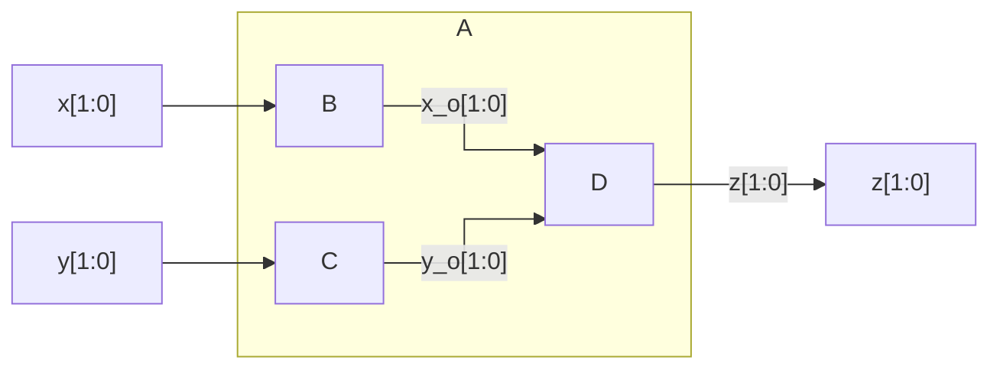
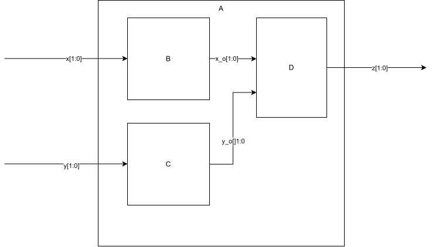
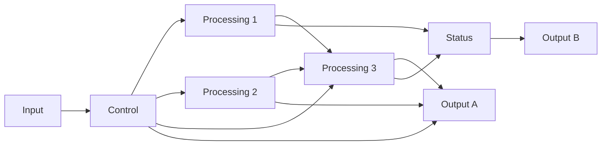
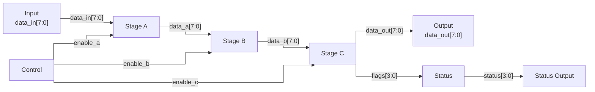
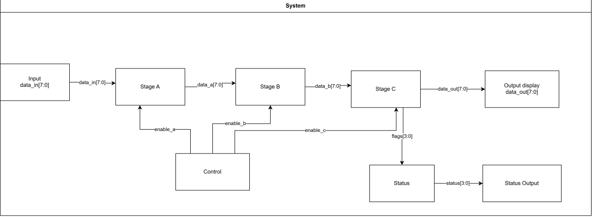

# Hardware Block Diagram Examples
The following example describes a top block called A, which is composed of 3 sub blocks B, C and D

Block **A** has two 2-bit inputs, `x[1:0]` and `y[1:0]`, and one 2-bit output, `z[1:0]`.

- **B** receives `x[1:0]` and produces `x_o[1:0]`
- **C** receives `y[1:0]` and produces `y_o[1:0]`
- **D** receives `x_o[1:0]` and `y_o[1:0]`, and produces `z[1:0]`

## Mermaid

### Source

```text
---
config:
  flowchart:
    curve: stepBefore
---
flowchart LR

    X["x[1:0]"]
    Y["y[1:0]"]

    subgraph A["A"]
        direction LR

        B["B"]
        C["C"]
        D["D"]

        B -->|"x_o[1:0]"| D
        C -->|"y_o[1:0]"| D
    end

    X --> B
    Y --> C
    D -->|"z[1:0]"| Z["z[1:0]"]
```

### Rendered diagram



### Limitations

Mermaid controls block placement automatically. The rendered diagram may:

- place **D** between **B** and **C**
- route `y_o[1:0]` differently from the intended shape
- attach connectors at different positions depending on the renderer version

The diagram represents the hierarchy and connectivity but does not guarantee a fixed hardware-style layout.

## Alternative Draw.io SVG

The Draw.io version provides fixed block placement and connector routing.

Export the selected diagram area as SVG.

### Files in this example

```text
diagrams_examples.md
diagram.drawio
diagram.svg
```

### Markdown source

```markdown

```

### Rendered diagram

Rendered diagram:



## Bad, Better and Good Hardware Diagrams

The examples below implement the same functional architecture but use different presentation styles.

### Bad Example

#### Rendered diagram



#### Why this is poor

- Control, data and status paths are mixed together.
- No data sizes described
- Most signal names are missing.
- Several blocks drive multiple distant destinations.
- The primary datapath is not obvious.
- Connections span unrelated parts of the diagram.
- The reader must trace wires to understand the architecture.

### Better Example

The primary datapath is arranged from left to right. Control is placed above the processing blocks, while status reporting is placed below the final stage.

#### Mermaid source

```text
---
config:
  flowchart:
    curve: stepBefore
---
flowchart LR

    INPUT["Input<br/>data_in[7:0]"]
    STAGE_A["Stage A"]
    STAGE_B["Stage B"]
    STAGE_C["Stage C"]
    OUTPUT["Output<br/>data_out[7:0]"]

    CONTROL["Control"]
    STATUS["Status"]
    STATUS_OUT["Status Output"]

    INPUT -->|"data_in[7:0]"| STAGE_A
    STAGE_A -->|"data_a[7:0]"| STAGE_B
    STAGE_B -->|"data_b[7:0]"| STAGE_C
    STAGE_C -->|"data_out[7:0]"| OUTPUT

    CONTROL -->|"enable_a"| STAGE_A
    CONTROL -->|"enable_b"| STAGE_B
    CONTROL -->|"enable_c"| STAGE_C

    STAGE_C -->|"flags[3:0]"| STATUS
    STATUS -->|"status[3:0]"| STATUS_OUT
```

#### Rendered diagram



#### Why this is better

- The primary datapath forms one continuous left-to-right chain.
- Every arrow is connected directly to a visible source and destination block.
- Inputs are on the left and outputs are on the right.
- Data signals include names, directions and bus widths.
- Control signals are secondary to the datapath.
- Status reporting branches from a defined processing stage.
- The diagram avoids nested subgraphs that can distort Mermaid routing.
- There are no dummy nodes, invisible nodes or floating arrowheads.
- The architecture remains understandable even if Mermaid adjusts block placement slightly.

#### Remaining Mermaid limitation

Mermaid still selects the exact block positions. The logical structure and connections are reliable, but precise placement of the control and status blocks is not guaranteed. Use Draw.io when fixed placement is required.

#### Good Example

This shows a good example, of course you could argue this can be further improved :)



### General Guidelines

Good hardware diagrams should:

- show hierarchy;
- minimise wire crossings;
- label important interfaces;
- separate data, control and status paths;
- show data width sizes when relevant;
- keep related functionality together;
- keep the primary datapath visually obvious;
- avoid long wires when possible;
- use consistent naming and formatting.

A reader should be able to identify the main datapath within a few seconds of looking at the diagram, when possible there are complex systems in which is almost unavoidable to break these guidelines
